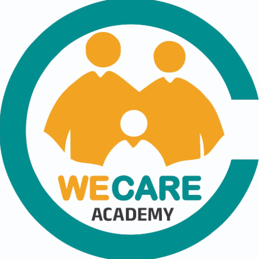

# TechMage Academy

<p align="center">
  
</p>

<p align="center">
  A Flutter-based mobile application for online learning.
</p>

---

## Features

- **User Authentication:** Secure login and registration for users.
- **Video Courses:** Browse and watch a variety of video courses.
- **Subscriptions:** Manage your subscriptions to different course channels.
- **Settings:** Customize your app experience.

## Getting Started

To get a local copy up and running, follow these simple steps.

### Prerequisites

- [Flutter SDK](https://flutter.dev/docs/get-started/install)
- An IDE with the Flutter plugin (e.g., [VS Code](https://code.visualstudio.com/), [Android Studio](https://developer.android.com/studio))

### Installation

1.  Clone the repo
    ```sh
    git clone https://github.com/ReverseEngineeringDude/wecare.git
    ```
2.  Install packages
    ```sh
    flutter pub get
    ```
3.  Run the app
    ```sh
    flutter run
    ```

## Dependencies

- [flutter](https://flutter.dev/)
- [cupertino_icons](https://pub.dev/packages/cupertino_icons)
- [shared_preferences](https://pub.dev/packages/shared_preferences)
- [http](https://pub.dev/packages/http)
- [video_player](https://pub.dev/packages/video_player)
- [chewie](https://pub.dev/packages/chewie)
- [provider](https://pub.dev/packages/provider)
- [native_device_orientation](https://pub.dev/packages/native_device_orientation)
- [skeletonsplus](https://pub.dev/packages/skeletonsplus)

## Screenshots

*(Coming Soon)*
---
